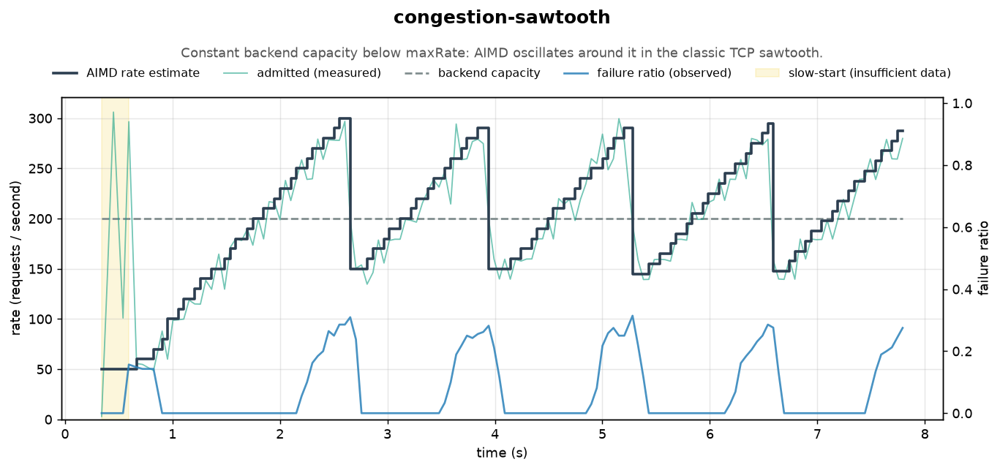
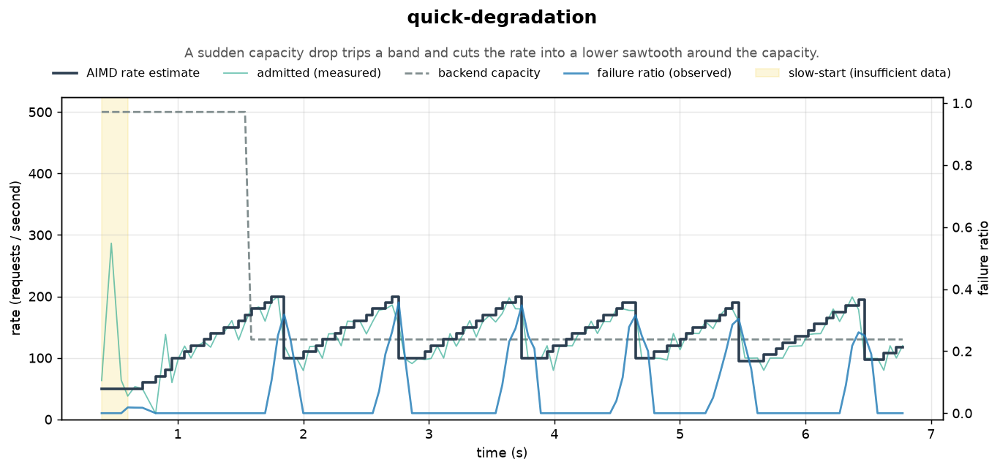
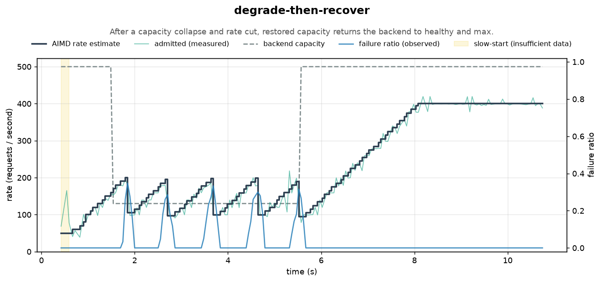
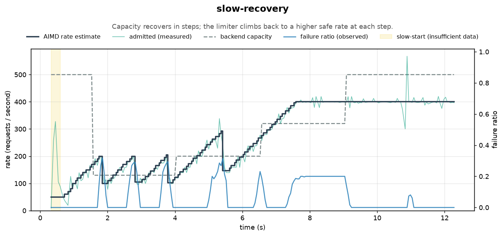
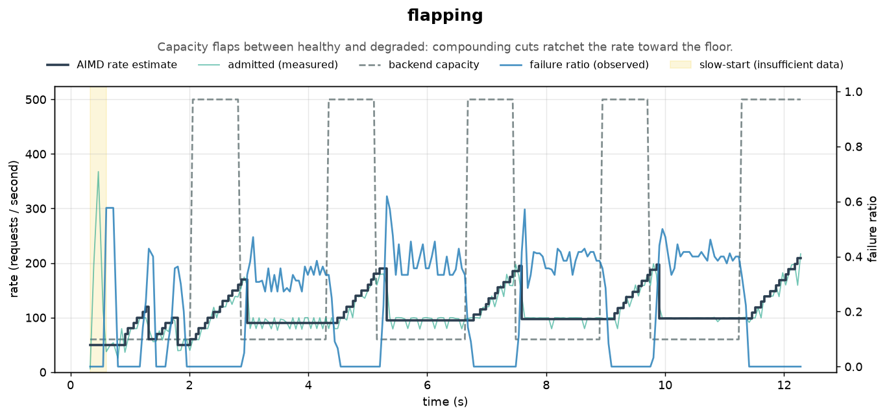
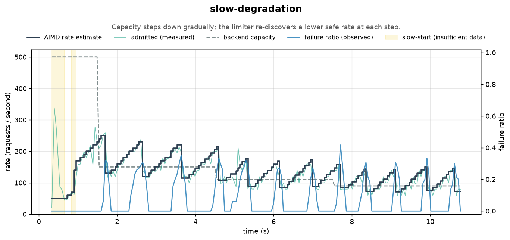
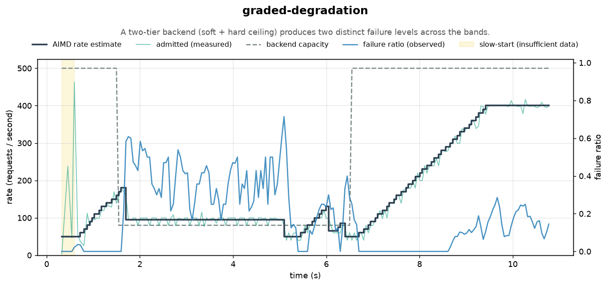
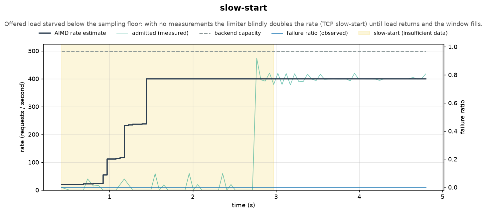
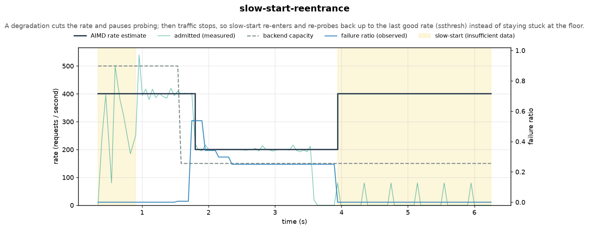

# Charts

Behavior charts for the [`adaptive-rate-limiter`](../adaptive-rate-limiter) and the
[`admission-controller`](../admission-controller). This module runs each structure through a set of closed-loop
scenarios against a *simulated* backend, exports the resulting timeseries as CSV, and renders them to PNG with
matplotlib. The images are what you see embedded in the project documentation.

There are two independent pipelines that share the same simulated [`Backend`](src/main/scala/io/mienks/resilience/charts/Backend.scala)
but write to separate data and image directories so they live side by side:

- **AdaptiveRateLimiter** (`charts/run` -> `docs/charts/data/`, rendered by `render.py`). Documented below.
- **AdmissionController** (`charts/runMain ...GenerateAdmissionCharts` -> `docs/charts/admission-data/`, rendered by
  `render_admission.py`). See [AdmissionController charts](#admissioncontroller-charts).

This is a documentation/tooling module only — it is not published (`publish / skip := true`).

## Pipeline

Generating charts is a two-stage pipeline: Scala produces the data, Python renders it.

### 1. Generate the data (Scala)

```bash
sbt "charts/run"
```

This drives every [`Scenario`](src/main/scala/io/mienks/resilience/charts/Scenario.scala) through the limiter (in
parallel) and writes, under `docs/charts/data/`:

- `<scenario>-samples.csv` — the dense sampled timeseries (`elapsed_ms`, `aimd_rps`, `admitted_rps`,
  `backend_capacity_rps`, `observed_failure_ratio`, `slow_start_active`). `slow_start_active` is `1` while the
  measurement window was starved (insufficient data) and the limiter ran on slow-start, `0` otherwise.
- `<scenario>-events.csv` — discrete control-loop events (rate changes and `FailureGradient` band crossings).
- `manifest.csv` — the index of scenarios the renderer reads.

You can override the output directory: `sbt "charts/run /tmp/charts-data"`.

### 2. Render the charts (Python)

```bash
python3 -m venv .venv && source .venv/bin/activate
pip install -r charts/scripts/requirements.txt
python charts/scripts/render.py
```

`render.py` is data-driven: it reads `manifest.csv` and writes one PNG per scenario into
`docs/images/adaptive-rate-limiter/`, so adding a scenario on the Scala side requires no change to the Python.
Override the directories with `--data-dir` / `--out-dir`.

## How the simulated backend works

The whole point of the adaptive rate limiter is to *discover* the rate a downstream resource can sustain. To exercise
that, we need a backend whose failure rate depends on how hard we hit it — otherwise the control loop has nothing to
react to. That backend is modeled in [`Backend.scala`](src/main/scala/io/mienks/resilience/charts/Backend.scala).

A backend phase is a **hard ceiling** plus zero or more **soft ceilings**, each a token bucket (the project's own
[`DynamicRateLimiter`](../rate-limiter)):

- The **hard ceiling** is the base, sustainable rate. Any call admitted *above* it fails outright (100%).
- Each **soft ceiling** (`SoftCeiling(capacity, failProbability)`, with `failProbability < 1.0`) is a tighter rate
  that fails only a *fraction* of the calls that overflow it.
- Every call consumes one token from the hard bucket and every soft bucket, and fails with the **most severe**
  `failProbability` among the ceilings it overflowed (the hard ceiling contributing `1.0`).

So the observed failure ratio is an emergent property of the rate the limiter admits — overflow a ceiling and failures
appear, back off and they clear. This is what closes the loop:

```
AIMD rate estimate ──admits requests──▶ Backend (hard + soft ceilings)
        ▲                                      │
        └────────── failure ratio ◀────────────┘
```

Two backend shapes are used:

- **Hard ceiling only** (`softCeilings = Nil`): one bucket at the base capacity whose overflow always fails. The
  failure ratio is essentially `1 - capacity/admitted`.
- **Graded** (a soft ceiling under the hard one): e.g. over `rps(80)` fail 100%, but already over the smaller
  `rps(40)` fail 50%. This produces two distinct failure levels and trips both hysteresis bands.

A [`Scenario`](src/main/scala/io/mienks/resilience/charts/Scenario.scala) is the limiter config plus a
`NonEmptyList[Backend.Phase]` — the backend's capacity over time. A hard ceiling *below* the limiter's `maxRate` is a
degraded backend; raising it again is recovery. The whole schedule is handed to `Backend.start` up front, and an
internal fiber walks it, reconfiguring the ceilings as each phase begins (there is no external capacity mutator). A
shared `Warmup` settle time is folded into the first phase's duration.
[`SimulationRunner`](src/main/scala/io/mienks/resilience/charts/SimulationRunner.scala) offers load through
`limiter.protect`, samples the limiter's rate/failure-ratio on a fixed cadence, and records every control-loop event.

Each `Backend.Phase` also carries an `offeredLoad` (defaulting to a rate well above any limiter `maxRate`), and the
client fibers pace themselves so the aggregate offered rate tracks it. At the default (full) load the admitted rate
tracks the limiter's refill rate, exactly as before. Dropping `offeredLoad` *below the sampling floor*
(`minNumberOfMeasurements / measurementWindow`) starves every window so the limiter reports insufficient data and
enters slow-start — the mechanism the [slow-start](#slow-start) scenario exercises.

> Note: rates are kept in the hundreds of rps even though the time scale is compressed to a few seconds. The closed
> loop derives the failure ratio from requests the limiter *actually admits*, so each measurement window needs enough
> admitted requests for the ratio to be meaningful.

## Scenarios

Each chart plots, on the left axis, the **AIMD rate estimate** (controlled variable), the **admitted** throughput
(measured), and the **backend capacity** (the bottleneck being discovered, dashed); on the right axis the limiter's
**observed failure ratio**. A shaded band marks any stretch where the limiter ran on **slow-start** (the measurement
window was starved of samples).

The additive increase only runs while the limiter considers the backend healthy: once a band trips, probing is paused
until the failure ratio fully clears, so a degraded sawtooth holds flat between cuts rather than ramping back up
immediately.

### congestion-sawtooth
Constant backend capacity below `maxRate`: AIMD oscillates around it in the classic TCP sawtooth — additive increase
ramps the rate up until failures appear, a multiplicative decrease cuts it, and the cycle repeats.



### quick-degradation
A sudden capacity drop trips a band and cuts the rate into a lower sawtooth around the new, reduced capacity.



### degrade-then-recover
After a capacity collapse and rate cut, restored capacity returns the backend to healthy and the rate climbs back to
`maxRate`.



### slow-recovery
Capacity recovers in steps; the limiter climbs back to a higher safe rate at each step.



### flapping
Capacity flaps between healthy and degraded: compounding cuts ratchet the rate toward the floor.



### slow-degradation
Capacity steps down gradually; the limiter re-discovers a lower safe rate at each step.



### graded-degradation
A two-tier backend (soft + hard ceiling) produces two distinct failure levels across the hysteresis bands.



### slow-start
The offered load is held *below* the sampling floor, so no measurement window ever collects enough samples to report a
failure ratio. With no signal to act on, the limiter would deadlock at a low rate (additive increase is paused while
unhealthy) — so it instead runs TCP-style slow-start, blindly doubling the rate estimate each window until it reaches
`maxRate`. Admitted throughput stays pinned at the offered load (demand-limited) while the estimate climbs; the shaded
band marks the starved, slow-start regime. When full load returns the window fills and the estimate settles.



### slow-start-reentrance
Slow-start is not just a start-up phase — it re-enters whenever the window is starved again. The run starts healthy at
`maxRate`, then a degradation trips a band and cuts the rate once; because the limiter is now unhealthy, additive
probing is paused and the rate holds flat (the flat bottom). Traffic then stops (offered load below the floor), so
every window goes starved and slow-start re-enters, doubling the rate back up. Crucially it caps at `ssthresh` — the
rate just before the cut — so it re-probes to the last known-good rate instead of blindly overshooting or staying
stuck at the floor. The shaded bands mark the starved, slow-start regimes.



## AdmissionController charts

The [`admission-controller`](../admission-controller) charts tell a different story than the rate limiter. Instead of
discovering and tracking a *rate*, the controller probabilistically sheds load so the backend's accepted goodput stays
near its capacity. Under overload it keeps the admitted load near `k * capacity` (with the SRE default `k = 2.0`),
holding a smooth plateau rather than the AIMD sawtooth, and on recovery the rejection probability returns to zero
because `k > 1` guarantees the gate fully reopens.

### Generate and render

```bash
sbt "charts/runMain io.mienks.resilience.charts.GenerateAdmissionCharts"   # -> docs/charts/admission-data/
python charts/scripts/render_admission.py                                  # -> docs/images/admission-controller/
```

The Scala app writes `<scenario>-samples.csv` (`elapsed_ms`, `offered_rps`, `admitted_rps`, `accepted_rps`,
`capacity_rps`, `rejection_probability`) and a `manifest.csv`. There is no events file — the controller has no
discrete state transitions to mark. `render_admission.py` is data-driven the same way `render.py` is.

The same simulated backend is reused: any call admitted *above* the hard ceiling is "throttled" (a failure), which is
exactly the downstream-overload signal the controller sheds against. Each scenario holds the offered load constant and
well above the degraded capacities, then schedules capacity over time via `Backend.Phase`.

Each chart plots, on the left axis, the **client input rate** (load before the gate), the **client allowed rate**
(what the controller admits), the **backend actual rate** (goodput, allowed minus throttled), and the **backend
capacity** (dashed); on the right axis the controller's **failure ratio** (dotted, unclamped) and **rejection
probability** in `[0, 1]`. The failure ratio keeps rising with throttling while the rejection probability stays pinned
at zero inside the dead zone — the gap between the two lines is the dead zone.

### steady-overload
Constant capacity below offered load: the controller sheds the excess, holding admitted near `k*capacity` and goodput
near capacity — a smooth plateau, no sawtooth.


### capacity-drop
A sudden capacity drop pushes the rejection probability from zero up to a steady shedding level.


### drop-then-recover
After a capacity collapse and shedding, restored capacity drives the rejection probability back to zero (`k > 1`
guarantees the gate fully reopens).


### slow-degradation
Capacity steps through four overload levels. The two milder levels keep the failure rate inside `k = 2`'s 50% dead
zone, so the controller tolerates the throttling (you can see the backend throttling — the gap to capacity — but the
rejection probability stays at zero and nothing is shed); the two harsher levels cross the dead zone and the rejection
probability steps up.


### Comparing `k`

The `k` parameter sets how aggressively the controller sheds. These runs hold the same capacity profile fixed and vary
only `k`, so the effect is isolated. The admitted plateau lands around `k * capacity`: higher `k` admits more (and
tolerates more backend-side throttling) while lower `k` sheds harder. Compare against the default `k = 2.0`
[steady-overload](#steady-overload) and [drop-then-recover](#drop-then-recover) above.

#### steady-overload-k1
`k = 1` is the plain failure ratio. Admitted collapses to around capacity with no wasted backend work, but the loop is
only marginally stable: the rate is jittery and often dips below capacity, under-utilizing the backend.


#### steady-overload-k1.5
`k = 1.5` is the middle ground: the admitted plateau settles around `1.5 * capacity`, between the `k = 1` and `k = 2`
cases, while goodput stays near capacity.


#### drop-then-recover-k1.5
`k = 1.5` over the recovery profile: a lower admitted plateau than `k = 2` while overloaded, and the gate still fully
reopens once capacity is restored.


#### drop-then-recover-k1
`k = 1` over the recovery profile lays bare the marginal stability: after capacity is restored the rejection
probability lingers high and only drifts back to zero slowly, instead of snapping back the way `k = 2` does. This is the
concrete reason the default is `k > 1`.


#### slow-degradation-k1.5
The same four-level staircase as [slow-degradation](#slow-degradation), but at `k = 1.5` the dead zone shrinks from a
50% failure rate to ~33%. The second (milder) level — tolerated with no shedding at `k = 2` — now crosses the dead zone,
so the controller begins shedding one step earlier. A direct, visual read of how `k` sets the tolerance threshold.


